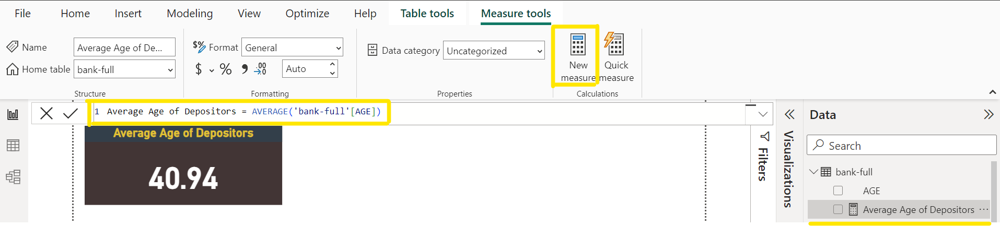
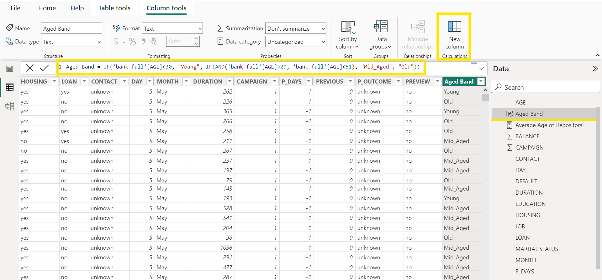
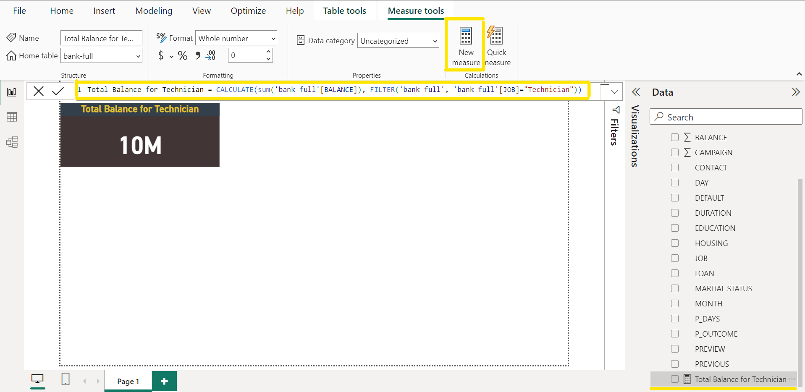
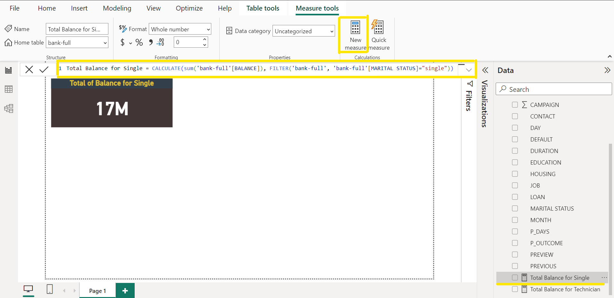
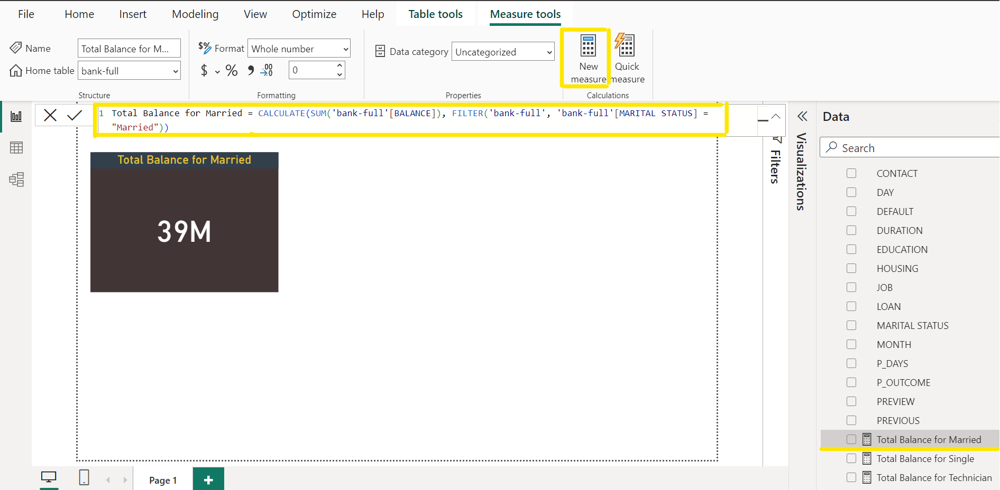
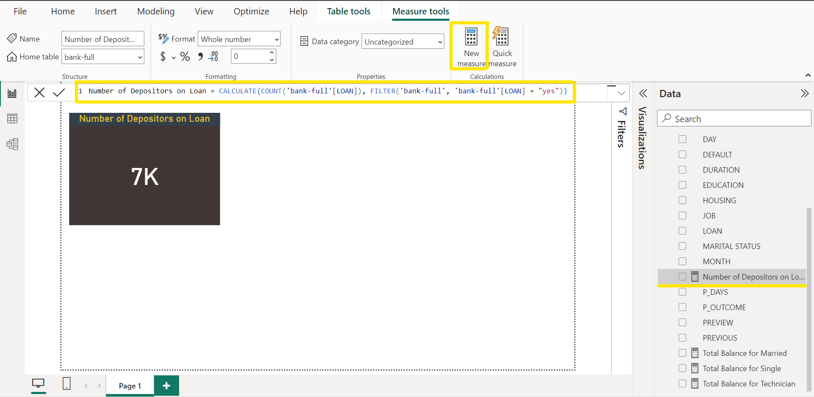

# DATA ANALYSIS EXPRESSIONS(DAX) ON BANK FULL DISTRIBUTION DATASET

## INTRODUCTION

In this data-driven exploration of the 'Bank Full Distribution' dataset, we will embark on a comprehensive journey to extract meaningful insights and enhance the dataset's analytical capabilities using advanced data analysis techniques. Our focus lies on implementing various data manipulation and calculation techniques to generate valuable metrics and classifications. The primary objectives include establishing a measure for the 'Average Age of Depositors,' introducing a new column denoting 'Age Band' to categorize depositors by age groups, and creating measures to assess the total balance specific to certain demographic criteria, such as occupation and marital status. Furthermore, we aim to quantify the number of depositors with active loans, employing the power of data analysis expressions. Through these tasks, we aim to uncover patterns, trends, and relevant information that can contribute to a more informed understanding of the dataset and support strategic decision-making processes.

## PROBLEM STATEMENT

The task at hand revolves around a comprehensive analysis of the 'Bank Full Distribution' dataset. The specific challenges to address include:

1. Develop a measure to calculate the average age of depositors.
   
2. Introduce a new column named 'Age Band' with the following categories:
   - 'Young' for ages below 30
   - 'Mid-aged' for ages between 30 and 50
   - 'Old' for ages above 50
     
3. Create a measure calculating the total balance for depositors with the following criteria:
   - Job: Technician
   - Marital: Single and Married
     
4. Formulate a measure to determine the number of depositors with active loans.


   Successfully addressing these challenges will contribute to a richer understanding of the dataset, unveiling patterns, trends, and relevant information crucial for informed decision-making in strategic and operational contexts.

## SKILLS AND CONCEPTS TO BE DEMONSTRATED

Skills to be Demonstrated in this task include:

- DAX (Data Analysis Expressions) Mastery
- Column Creation with DAX
- Conditional Logic in DAX
- Data Visualization
- Data Interpretation

Demonstrating proficiency in these skills and concepts will not only showcase a comprehensive understanding of Power BI but also ensure the effective extraction of valuable insights from the 'Bank Full Distribution' dataset.

## ANALYSIS, DISCUSSIONS AND RESULTS

### 1. Develop A Measure To Calculate The Average Age Of Depositors:

DAX Measures serve as calculations that aggregate data, providing insights into the underlying data model. They empower users to perform calculations, such as sums, averages, and counts, based on specified conditions. Measures act as containers generating a single value, distributable across different categories. To create a measure for calculating the average age of depositors, follow these steps:

- Begin by clicking on the "New Measure" option in the Power BI ribbon to create a new measure. Once selected, a measure will appear directly beneath the Power BI ribbon and in the data pane, marked by a calculator icon, signifying its nature as a measure.
- Edit the newly created measure beneath the Power BI ribbon by replacing the default content with "Average Age of Depositors," reflecting the intended calculation. Then, use the equal sign and apply the average function. In parentheses, specify the age column along with the corresponding table. Execute the analysis by pressing Enter. The syntax would be as follows:

```powerbi
SYNTAX:
MEASURE = AVERAGE(TABLE_NAME[COLUMN_NAME])

APPLYING SYNTAX:
Average age of depositors = AVERAGE('Bank full'[age])
```

- Since the calculated result is neither a calculated column nor a calculated table, view the outcome using the card visual in the visualization pane. Add a card visual to the canvas page, dragging the result (Average Age of Depositors) from the data pane into the card visual.
- The resulting visualization will display the average age of depositors, in this case, 40.94. Enhance the visualization by utilizing the "Format" page option in the visualization pane, allowing for customization of background color, title, and call-out values to ensure a visually appealing presentation.



### 2. Introduce A New Column Named 'Age Band' With The Following Categories:

   - 'Young' for ages below 30
   - 'Mid-aged' for ages between 30 and 50
   - 'Old' for ages above 50

     In this scenario, as we are not aggregating a single value, we will use calculated columns instead of measures. To introduce a new column named 'Age Band', categorizing ages as 'Young' for those below 30, 'Mid-aged' for ages between 30 and 50, and 'Old' for ages above 50, follow these steps:
      - Begin by clicking on the table view icon on the left side of the Power BI environment to visualize the table and the existing 'Age' column that will be manipulated.
      - Click on "New Column" in the Power BI ribbon to create a new calculated column. A column name will appear beneath the Power BI ribbon and in the data pane, marked with an EFX icon, indicating its status as a column.
      - Edit the column name beneath the Power BI ribbon by replacing it with 'Age Band,' reflecting the nature of the new calculation. Then, use the equal sign and apply the 'IF' function. In parentheses, specify the conditions to be met, and execute the analysis by pressing Enter. The syntax would be as follows:

       ```powerbi
       SYNTAX:
       Age Band = IF('Bank full'[Age]<30, "Young", IF(AND('Bank full'[Age]>29, 'Bank full'[Age]<51), "Mid-aged", "Old"))
       ```
        - The calculated result of this analysis will be visible in the table since it is a calculated column and not a measure.

          

### 3. Create A Measure Calculating The Total Balance for Depositors With The Following Criteria:

   - Job: Technician
   - Marital: Single and Married

     To generate a measure calculating the total balance for depositors based on specific criteria, follow these steps:

     - Click individually on "New Measure" in the Power BI ribbon to create a new measure. Upon doing so, a measure will appear beneath the Power BI ribbon and in the data pane, marked with a calculator icon, indicating its status as a measure.
     - Edit the measure beneath the Power BI ribbon by replacing the default content with distinct names for each calculation: 'Total Balance for Technician,' 'Total Balance for Single,' and 'Total Balance for Married.' These names reflect the specific criteria for each calculation.
     - Use the equal sign and apply the 'CALCULATE' function. In parentheses, specify the conditions to be met using the 'FILTER' function. For 'Total Balance for Technician,' the condition is 'Job' equals "Technician," and for the marital status measures, the conditions are 'Marital Status' equals "Single" and "Married" respectively.
     - Execute the analysis by pressing Enter. The syntax for each measure would be as follows:

       ```powerbi

       JOB: TECHNICIAN

       Total Balance for Technician = CALCULATE(SUM('Bank Full'[Balance]) , FILTER('Bank Full', 'Bank Full'[Job] = "Technician"))

       MARITAL: SINGLE and MARRIED

       Total Balance for Single = CALCULATE(SUM('Bank Full'[Balance]) , FILTER('Bank Full', 'Bank Full'[Marital Status] = "Single"))

       Total Balance for Married = CALCULATE(SUM('Bank Full'[Balance]) , FILTER('Bank Full', 'Bank Full'[Marital Status] = "Married"))
       ```

       The result of this analysis indicates a total balance of 10 million for technicians, 17 million for singles, and 39 million for married individuals.

       JOB:TECHNICIAN
       :-------------:
       

        MARITAL: SINGLE                  
       :----------------------:
       

        MARITAL: MARRIED           
       :----------------------:
       

### 4. Formulate A Measure To Determine The Number Of Depositors With Active Loans:

To create a measure determining the number of depositors with active loans, follow these steps:
- Click on "New Measure" in the Power BI ribbon to initiate the creation of a new measure. A measure will appear beneath the Power BI ribbon and in the data pane, identified by a calculator icon, indicating its nature as a measure.
- Edit the measure beneath the Power BI ribbon by replacing the default content with 'Number of Depositors on Loan,' reflecting the specific calculation being performed.
- Use the equal sign and apply the 'CALCULATE' function. In parentheses, specify the condition to be met using the 'FILTER' function. For this measure, the condition is 'Loan' equals "Yes".
- Execute the analysis by pressing Enter. The syntax for the measure would be as follows:

   ```powerbi
   Number of Depositors on Loan = CALCULATE(SUM('Bank Full'[Loan]) , FILTER('Bank Full', 'Bank Full'[Loan] = "Yes"))
   ```

   The result of this analysis will display the number of depositors with active loans as seven(7) thousand. This measure calculates the sum of the 'Loan' column for rows where the 'Loan' status is "Yes," providing a clear count of depositors with active loans.



## RECOMMENDATION

Based on the insights derived from the analysis of the 'Bank Full Distribution' dataset, several key recommendations emerge:

- Targeted Marketing Strategies:

  Tailor marketing strategies based on the identified age bands. Understanding the distribution of age groups among depositors can guide the creation of targeted campaigns and financial products that resonate with different demographics.

- Occupation-Specific Offerings:

  Recognize the significant total balance held by depositors in the 'Technician' occupation. Consider developing specialized financial products or services to cater to the needs and preferences of individuals in this occupation.

- Loan Management and Engagement:

  Given the number of depositors with active loans, consider refining loan management practices and introducing customer engagement initiatives to foster a positive relationship with this segment. This could include personalized loan management tools or targeted communication about loan-related benefits.

## CONCLUSION

In conclusion, the analysis of the 'Bank Full Distribution' dataset using Power BI has provided valuable insights into the demographic and financial characteristics of depositors. The calculated measures and columns, such as the 'Average Age of Depositors' and the 'Age Band,' offer a nuanced understanding of the customer base. Additionally, the total balance assessments based on occupation and marital status, along with the count of depositors with active loans, contribute to a comprehensive overview.

These findings empower decision-makers to make informed strategic choices, aligning products and services with the specific needs of different customer segments. The utilization of Power BI has proven instrumental in transforming raw data into actionable insights, highlighting the importance of leveraging advanced analytics tools for data-driven decision-making in the banking sector.


